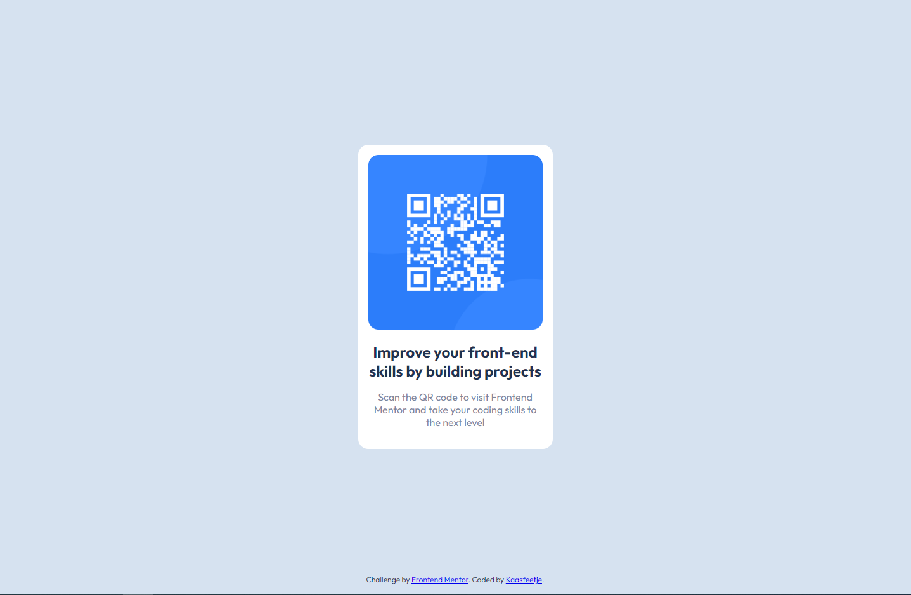

# Frontend Mentor - QR code component solution

This is a solution to the [QR code component challenge on Frontend Mentor](https://www.frontendmentor.io/challenges/qr-code-component-iux_sIO_H). Frontend Mentor challenges help you improve your coding skills by building realistic projects.

## Table of contents

-   [Overview](#overview)
    -   [Screenshot](#screenshot)
    -   [Links](#links)
-   [My process](#my-process)
    -   [Built with](#built-with)
    -   [What I learned](#what-i-learned)
    -   [Continued development](#continued-development)
    -   [Useful resources](#useful-resources)
-   [Author](#author)
-   [Acknowledgments](#acknowledgments)

**Note: Delete this note and update the table of contents based on what sections you keep.**

## Overview

### Screenshot

### Links

-   Solution URL: [Github](https://github.com/Kaasfeetje/Frontend-Mentor-qr-code-component)
-   Live Site URL: [Site](https://qr-code-component-kaasfeetje.netlify.app/)

## My process

### Built with

-   HTML
-   CSS

## Author

-   Github - [Kaasfeetje](https://github.com/Kaasfeetje)
-   Frontend Mentor - [@Kaasfeetje](https://www.frontendmentor.io/profile/Kaasfeetje)
-   Twitter - [@VeldhuisMax](https://twitter.com/VeldhuisMax)
